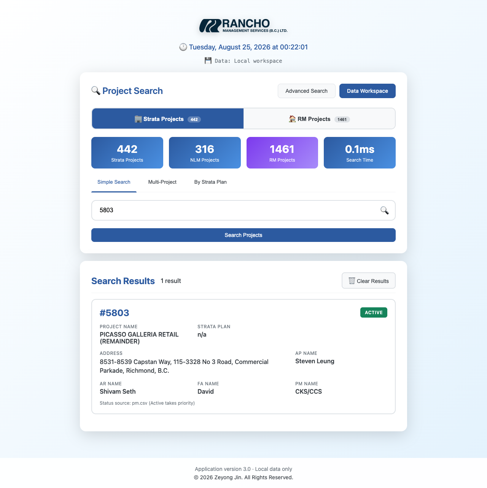

# Rancho Project Search — Python

A local-first Python migration of the original `zeyongj.github.io` project search site. It preserves the Rancho visual design and project-number workflow while adding a password-free Data Workspace, one-file Excel import, and expanded fuzzy search.



## What changed

- Runs locally in Python; project data never needs to leave the computer.
- Choose a browser window or an app-style system WebView at launch.
- “Admin Login” is now **Data Workspace** and requires no password.
- Directly copy, paste, edit, validate, save, download, or replace CSV/JSON files.
- Upload one Project List `.xlsx`; the application retains it and regenerates `pm.csv` and `nlm.csv` from the `Active Projects` and `NLM` worksheets.
- Project number remains the primary key.
- Active precedence is enforced in the data layer: if a project number occurs in `pm.csv`, matching `nlm.csv` rows are never searched or shown as NLM.
- Advanced Search supports fuzzy project name, address, strata plan, PM, FA, AP, and AR fields.
- Existing RM search and AP/AR portfolio rules are retained.
- Every data replacement creates a timestamped backup.

## Requirements

- Python 3.10 or later
- Windows 11 or macOS

## Quick start

```bash
python -m venv .venv
```

Activate the environment:

```text
Windows: .venv\Scripts\activate
macOS:   source .venv/bin/activate
```

Install and run:

```bash
python -m pip install -e ".[desktop]"
python run.py
```

The launcher offers:

- **Open as App Window** — the same UI inside the system WebView.
- **Open in Local Browser** — recommended when copying/pasting large data files or using browser tools.

Direct launch options:

```bash
python run.py --mode window
python run.py --mode browser
python run.py --mode browser --data-dir "D:\Rancho Data"
```

If the optional desktop WebView is unavailable, app-window mode safely falls back to the local browser.

## Data workflow

Open **Data Workspace** from the search page. There are four update paths:

1. Upload one Project List workbook (recommended).
2. Replace one selected CSV or JSON file.
3. Edit a CSV or JSON file in the direct text editor.
4. Maintain AP/AR assignments with the structured row editor.

The live source folder is `data/` when running this repository. Packaged portable builds place a writable `data/` folder beside the executable/app bundle. Use **Open Data Folder** to reach it without guessing the path.

See [docs/DATA_GUIDE.md](docs/DATA_GUIDE.md) for field mapping, backup behavior, and search rules.

## Validation

Run the standard-library test suite:

```bash
PYTHONPATH=src python -m unittest discover -s tests -v
```

The suite covers source loading, Excel conversion, Active/NLM precedence, address extraction, backups, HTTP endpoints, local write protection, and offline static assets.

## Privacy and security

- The HTTP service binds only to `127.0.0.1`.
- UI writes require a custom local-request header, which blocks ordinary cross-site form submissions.
- No CDN, analytics, public API, location service, or cloud data source is used at runtime.
- There is intentionally no password: anyone with access to this local program and its data folder can modify the data.

## Repository layout

```text
data/                         Editable local source data
src/rancho_project_search/    Python application
  default_data/               First-run data seed
  web/                        Preserved and extended Rancho UI
tests/                        Unit and HTTP integration tests
docs/                         Data and migration notes
run.py                        Source checkout launcher
```

## License

Copyright © 2026 Zeyong Jin. All rights reserved. See [LICENSE](LICENSE).

